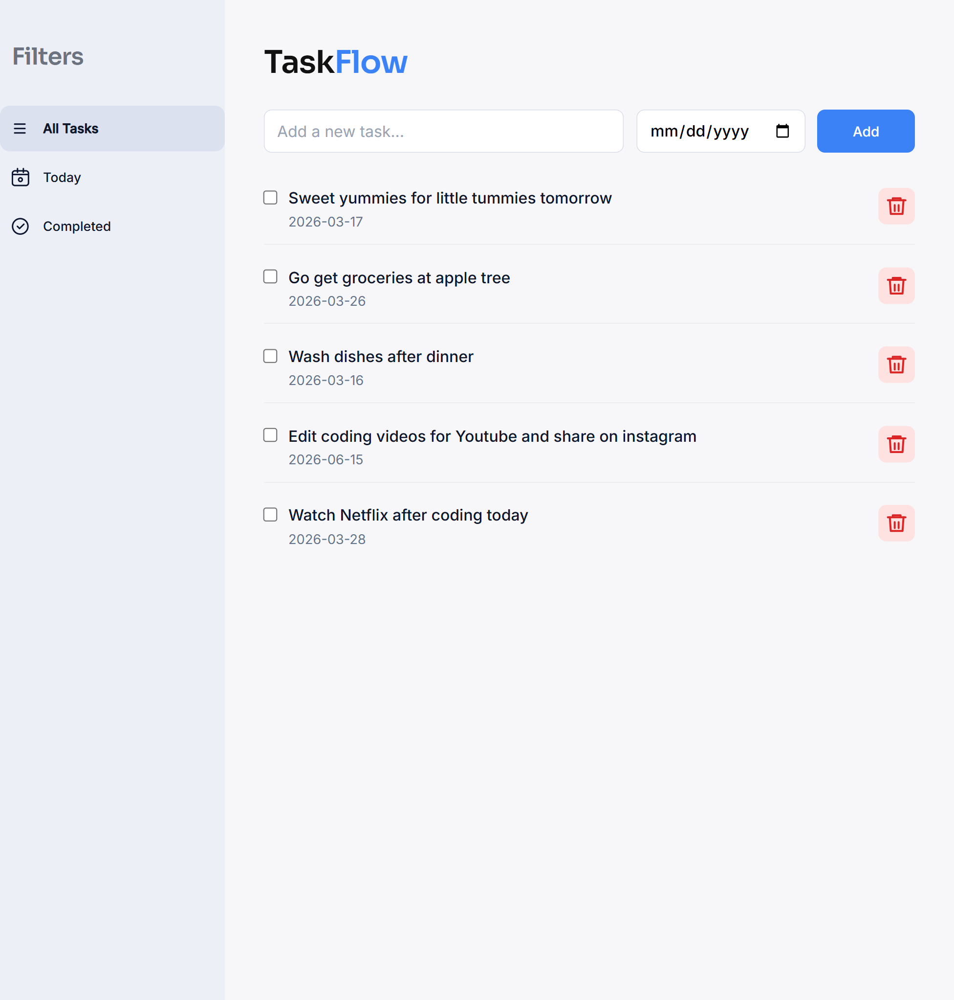
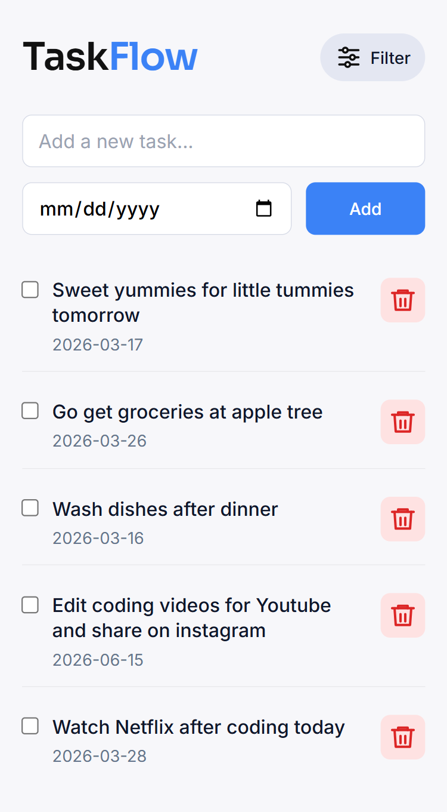

# Taskflow App

A clean and responsive task management app built with HTML, CSS, and JavaScript.

## Features

- Add tasks with date selection
- Filter tasks (All, Today, Completed)
- Dynamic rendering based on active filter
- Form validation with inline error messages
- Responsive layout (mobile → desktop)
- Sidebar navigation for desktop
- Clean UI/UX built from scratch

## Tech Stack

- HTML5
- CSS3 (Modular structure: base, layout, components)
- Vanilla JavaScript (no frameworks)

## Key Highlights

- Built with a scalable UI architecture (BEM naming + modular CSS)
- Dynamic rendering logic based on application state
- Thoughtful responsive design with breakpoint strategy
- Focus on clean UX and visual hierarchy

## Preview

### Desktop

### Mobile

## Live Demo

👉 [View Taskflow App](https://timothykorea.github.io/taskflow-app/)